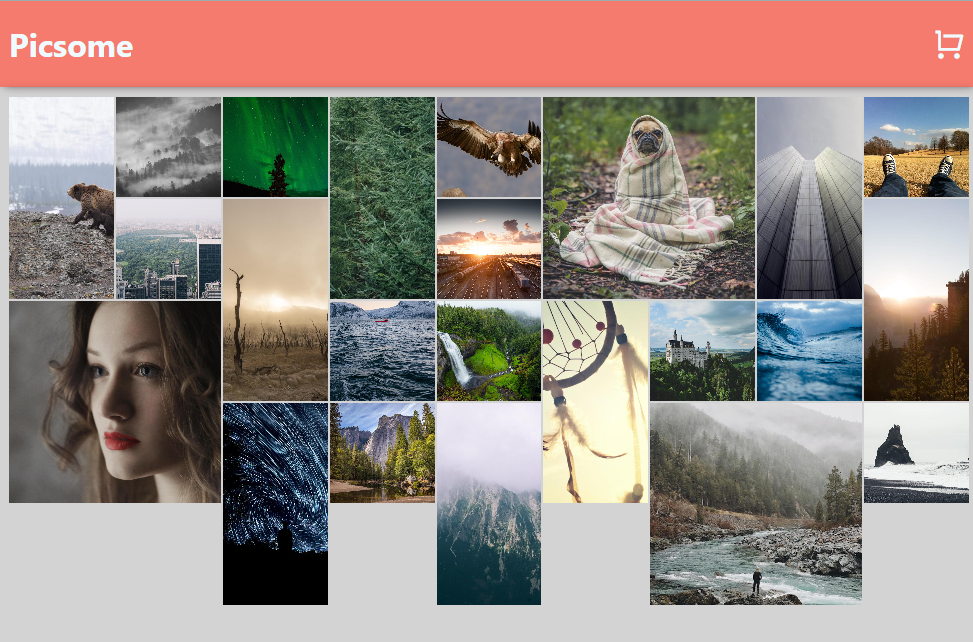
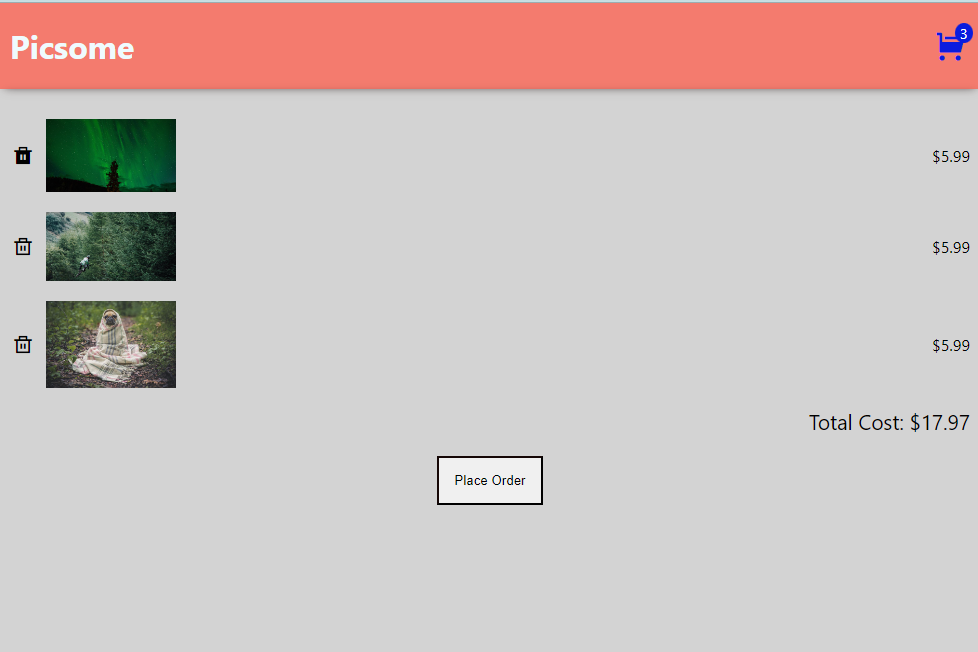

# picsome app

deployed wediste URL: https://shvinprog.github.io/
(Note: make repo as public before sharing)

This app has been created with React and deployed.
Implemented the following concepts - custom API, hooks, context and useRef()

source code avialble in personal directory along with deployed website URL.

In the project directory, you can run:

### `npm install`

### `npm start`

Runs the app in the development mode.\
Open [http://localhost:3000](http://localhost:3000) to view it in your browser.

The page will reload when you make changes.\
You may also see any lint errors in the console.

### `npm run build`

Builds the app for production to the `build` folder.\
It correctly bundles React in production mode and optimizes the build for the best performance.

### Deplyed wedsite url ""

### picsome app images

## main page

## main hover on image/toggle on image effect

## cart empty

## items added to the cart

## hover on delete item

## processing order

## after processing order

